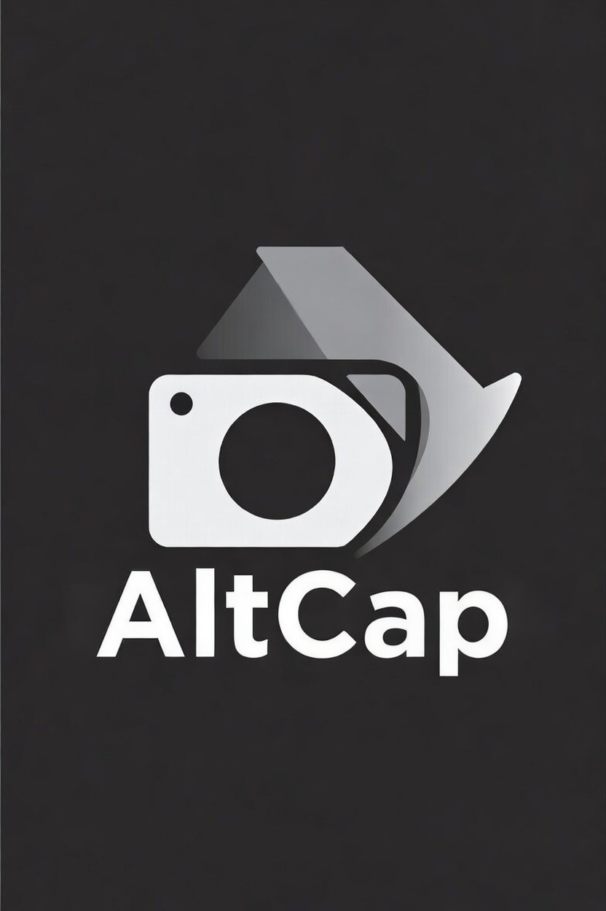

# AltCap

  
   
  <h3>The 1-Click Video Screenshot Tool</h3>
  

    Capture HQ video frames in Full Screen without the pause button, mouse cursor, or black bars.
  

## 📥 Easy Download (One-Click)
New to GitHub? Don't worry about the code.
**[👉 Click here to Download AltCap (ZIP)](https://github.com/SpunkySenpai991/AltCap/archive/refs/heads/main.zip)**

*After downloading, just Right Click -> "Extract All", then follow the Installation Guide below.*

---

## 😫 The Problem
You are watching a lecture or tutorial in **Full Screen**. You need to save a formula, a slide, or a memory.
1. You press **Print Screen**.
2. The video minimizes, or the "Pause" overlay appears and blocks the text.
3. You have to open Paint/Snipping Tool to crop out the browser tabs and taskbar.

## 😎 The Solution: AltCap
**AltCap** grabs the raw video frame with a single keystroke.
1. You press **Alt**.
2. **Done.**

The clean image is instantly saved to your downloads.

## 🎯 Perfect For...
*   **Students:** Snap formulas and slides on Udemy/Coursera instantly for last-minute revision.
*   **Memories:** Save high-quality (HQ) moments from vlogs or music videos.
*   **Clean Capture:** Gets the video only. No mouse cursor, no play bar, no window borders.

## ⚠️ Important: "Black Screen" Fix (Udemy/Netflix)
If your screenshots come out **Black**, it is because of Chrome's Hardware Acceleration (DRM protection).
To fix this (required for sites like Udemy):
1. Click the **3 Dots** in the top right of Chrome.
2. Go to **Settings**.
3. Click **System** on the left menu.
4. **Turn OFF** "Use graphics acceleration when available".
5. Relaunch Chrome.

## 🛠️ Installation Guide
1. **Unzip** the file you downloaded above.
2. Open Chrome and type `chrome://extensions` in the address bar.
3. Toggle **Developer Mode** (top right switch).
4. Click **Load Unpacked**.
5. Select the `AltCap-main` folder.

## 📄 License
This project is licensed under the MIT License - see the [LICENSE](LICENSE) file for details.
